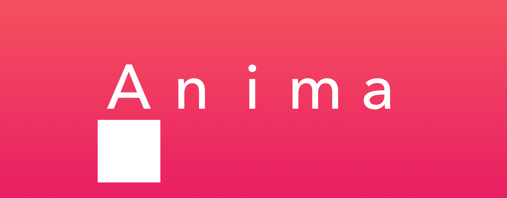
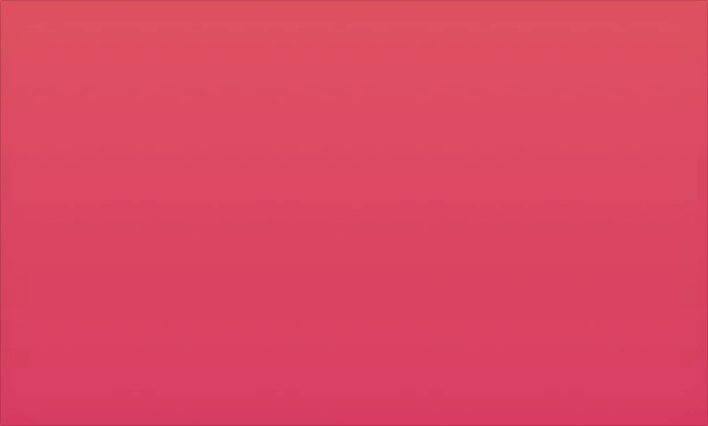
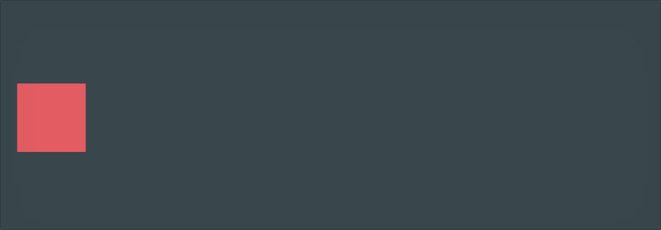
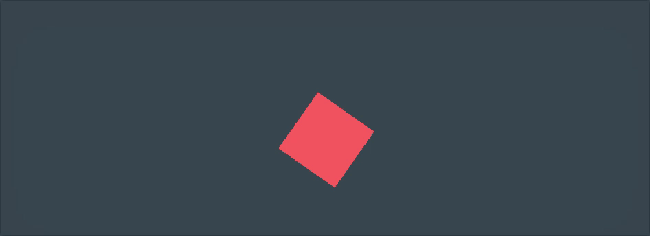
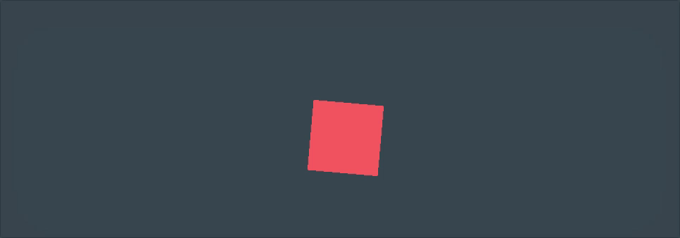

[](http://cocoapods.org/pods/Anima)
[](http://cocoapods.org/pods/Anima)
[](http://cocoapods.org/pods/Anima)


<p align="center">

</p>

# Anima
Anima is chainable Layer-Based Animation library for Swift3.<br>
It support to make sequential and grouped animation more easily.



is written as follows.

```swift
let startAnimations: [AnimaType] = [.moveByY(-50), .rotateByZDegree(90)]
let moveAnimations: [AnimaType] = [.moveByX(50), .rotateByZDegree(90)]
let endAnimations: [AnimaType] = [.moveByY(-50), .rotateByZDegree(90)]

animaView.layer.anima
    .then(.opacity(1.0))
    .then(group: startAnimations)
    .then(group: moveAnimations, options: labelAnimaOption(index: 0))
    .then(group: moveAnimations, options: labelAnimaOption(index: 1))
    .then(group: moveAnimations, options: labelAnimaOption(index: 2))
    .then(group: moveAnimations, options: labelAnimaOption(index: 3))
    .then(group: endAnimations, options: labelAnimaOption(index: 4))
    .then(group: [.scaleBy(0.0), AnimaType.opacity(0.0)])

func labelAnimaOption(index: Int) -> [AnimaOption] {
    let labelAnima = labels[index]?.layer.anima

    return [.completion({
        labelAnima?.then(.opacity(1)).fire()
    })]
}
```

## Requirements
Anima require for Swift3 iOS9.0📱<br>

Sorry, Anima is not support macOS.
But I'm going to support it soon 💪

## Features
* All timing modes from [easings.set](http://easings.net/) are implemented.
* Spring Animation ( featured by [CASpringAnimation](https://developer.apple.com/reference/quartzcore/caspringanimation) )
* Type-Safed Animation KeyPath ()

## Usage

### Move Position
If you want to translate `CALayer.position` relatively, use `.moveByX(CGFloat)`, `.moveByY(CGFloat)`, `.moveByXY(x: CGFloat, y: CGFloat)` AnimaTypes.



```swift
layer.anima.then(.moveByX(50)).fire()
```

or destination is determined, use `.moveTo(x: CGFloat, y: CGFloat)`.

※ Anima doesn't update `CALayer.position` value for animations. Because when update Layer-backed view's layer position value, It will be resetted to default value frequently.

### Sequential Animation
Anima supports.

### Group Animation
To run animation concurrently, you use `CAAnimationGroup` with CoreAnimation.
In Anima, you can use `Anima.then(group: )` to run some `AnimaType` concurrently.

Below is an example of how to run moving, scaling and rotating animations concurrently.


```swift
layer.anima
    .then(group: [.moveByX(200),
                .scaleBy(1.5),
                .rotateByZDegree(180)])
    .fire()
```

### Animation Options
There are some options for Anima.

* duration(TimeInterval)
* timingFunction(TimingFunction)
	* Change timing function defining the pacing of the animation.
	* Default timing function is at `Anima.defaultTimingFunction`. If you do not set the timing function option, defaultTimingFunction is used.
	* Please read `Anima.TimingFunction.swift`
* repeat(count: Float)
	* To run animation infinitely, set `.infinity`.
* autoreverse
* completion(() -> Void)

you can use these values as belows.

```
layer
    .anima
    .then(.moveByX(100), options: [.autoreverse,
                                   .timingFunciton(.easeInQuad),
                                   .repeat(count: 3),
                                   .completion({
                                    print("completion")
                                   })])
    .fire()
```

### Rotate Animation & AnchorPoint

AnimaType has 3 rotation animation type, `.rotateByX`, `.rotateByY`, `.rotateByZ`.
and each animation type has 2 value types, `degrees` and `radians`.
you use whichever you like.

and CALayer has `AnchorPoint`. Rotating, moving, or other Animations are affected by it. Default value is (0.5, 0.5).
`AnimaType.moveAnchor(AnimaAnchorPoint)` can move layer's AnchorPoint.



```swift
layer.anima
    .then(.rotateByZDegree(360))
    .then(.moveAnchor(.topLeft))
    .then(.rotateByZDegree(360))
    .fire()
```

or If you want to change only AnchorPoint, use `Anima.then(setAnchor: AnimaAnchorPoint)`.



```swift
layer.anima
    .then(.rotateByZDegree(360))
    .then(setAnchor: anchorPoint: .topLeft)
    .then(.rotateByZDegree(360))
    .fire()
```

### Move Path
If you want to make moving animation more complex, use `.movePath(path: CGPath, keyTymes: [Double])`.
Anima example app has sample of creating animation by drag gesture. you see it!

but It has any problems when you use with `AnimaOption.autoreverse`.
so If you use it, please be careful of options.

### Original KeyPath
If you want to animate other animatable values, You can use `AnimaType.original(keyPath: String, from: Any?, to: Any)` for it.
`CAEmitterLayer`'s animation is like this.

```swift
let layer = CAEmitterLayer()
layer.emitterPosition = CGPoint(x: 100.0, y:100.0)

layer.anima
    .then(.original(keyPath: #keyPath(CAEmitterLayer.emitterPosition), from: layer.emitterPosition, to: CGPoint(x: 200.0, y:200.0)))
    .fire()       
```

## Example

To run the example project, clone the repo, open `Anima.xcodeproj`, and run target `Anima iOS Example`.
 
## Installation

### Cocoapods
Anima is available through [CocoaPods](http://cocoapods.org). To install
it, simply add the following line to your Podfile:

```ruby
pod "Anima"
```

### Carthage
Add github `satoshin21/Anima` to your `Cartfile`.
Execute carthage update to install it.

## Author

Satoshi Nagasaka, satoshi.nagasaka21@gmail.com

## License

Anima is available under the MIT license. See the LICENSE file for more info.
